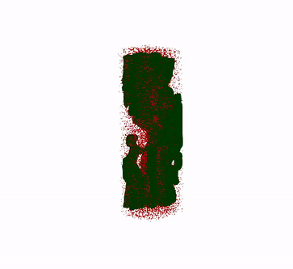
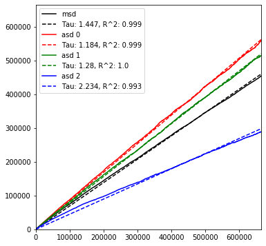

# Understanding Airspace in Leaves: 3D Anatomy and Directional Tortuosity

## Background 
Leaves vary in porosity (the proportion of air) and tortuosity (the amount of twists and turns) and this variation is related to leaf function. To investigate these properties we 
imaged 4 Eucalyptus leaves using serial block face scanning electron microscopy 


3D renders of segmented SBF-SEM datasets. green indicates mesophyll cells, grey epidermis and blue the vascular bundle, the airspace is the void.  

We used the Pytrax package https://www.sciencedirect.com/science/article/pii/S2352711019302286 to calculate directional tortuosity for each species using a random walk technique.
We did this for the whole leaf and also different leaf areas (the palisade and spongy mesophyll). 

In the current random walk application, a walker moves randomly and orthogonally a designated number of steps, i.e. voxels, within the airspace. 
Walkers bounce against boundaries such that they move into a reflected image if reaching the edge of the image stack or bounce back into the airspace if it hits a cell. 
To have a walker move into reflected space, binary image stacks were trimmed at the adaxial and abaxial epidermis edges so that the airspace, and not cells, were touching the stack’s canvas edges.
For each image stack, we used 10,000 walkers, each walking a number of steps equal to the smallest image dimension squared, multiplied by 3. 
This approach to determine the number of steps allowed walkers to reach a constant mean squared displacement slope.
The displacement at each step is then averaged for all walkers and produces the mean square displacement (see figure below), and a constant slope reflecting a representative volume being walked through. 
The tortuosity is then extracted from the inverse of the slope of the linear regression between the total number of steps and the mean square displacement, after forcing the intercept through zero. 
The axial tortuosity can be calculated similarly along each axis and then the result is multiplied by the number of axes.

Here is an example on a 2D image: 


The random walk workflow for calculating the directional tortuosity in the airspace using E. occidentalis as a 2D example (slice 30/690) and the same image area as open space. 
The ad and ab axial epidermis are removed so the walkers can move into a reflected image and the image is made binary: airspace (yellow) and cells (purple). 
The top panel (a-c, all cells removed and the simulation run on all airspace) highlights that when there are no obstacles mean square displacement and axial displacement 
are all the same and increase linearly with time, this can be observed in panel c. 
Furthermore, the slope of the curve in panel c is 1, which indicates that there is no tortuosity.
The lower panel (d-f, all cells included) highlights that when the walkers interact with obstacles mean square displacement and axial displacement are not the same and do increase linearly with time.
This is illustrated by the coloured arrows in panel f: the orange arrow relates to vertical tortuosity, the reciprocal of its slope is 1.24 which can be interpreted as a tortuosity of 1.24 m2 m-2.
The same approach applies for the overall tortuosity (black arrow) and horizontal tortuosity (green arrow).  (note that for this 2D example we used 10 000 walkers and 10 000 steps

The animation below visulises the simulation. Note that walkers outside the mesophyll cells are in a reflected image


The ‘random walk’ workflow for calculating the directional tortuosity in the IAS using E. parramattensis as a 3D example. 
# Setting up the random walk simulation  
## Code to calculate directional tortuosity for the whole leaf and leaf sub volumes

Load packages

Not all are needed but they are all useful for image analysis

```python
import sys
import os
import numpy as np
from pandas import DataFrame
from scipy import stats
from scipy.ndimage.morphology import distance_transform_edt, binary_erosion
import skfmm
import skimage.io as io
from skimage import img_as_ubyte
from skimage.util import invert
from skimage.measure import label, regionprops, marching_cubes_lewiner, mesh_surface_area
from skimage.transform import resize
import time
from tqdm import tqdm
import joblib
import multiprocessing
import cv2
from os import listdir
import matplotlib.pyplot as plt 
import openpnm as op
import porespy
import pytrax as pt
from scipy import ndimage
```
Define a Threshold Function 

```python
def Threshold(input_img, Th_value):
    tmp = np.zeros(input_img.shape, dtype=np.bool)
    if isinstance(Th_value, int):
        tmp[input_img == Th_value] = 1
    else:
        if isinstance(Th_value, float):
            tmp[input_img > 0. & input_img < 1.] = 1
        else:
            for th_val in range(len(Th_value)):
                tmp[input_img == Th_value[th_val]] = 1
    return tmp
```

Set the image directory - eventually this should download straight from Zenodo
```python
image_dir = "C:/Users/rhar4/Desktop/3D EUC GITHUB/"
```
Load in the images

```python 
composite_stack = io.imread(image_dir + 'E parramattensis-Whole Leaf.tif')
plt.imshow(composite_stack[1])
```


The above image shows there are multiple grey scale values - this is the from the image we used to get cell volume and surface area so we need to make a binary version
Set the airspace value - and check it makes an image that is airspace (yellow) and cells (purple)

```python 
ias_value = 196
airspace_stack = Threshold(composite_stack, ias_value)
plt.imshow(airspace_stack[1])
```


The above is a TRUE/FALSE image but we need a 0/1 image

```python 
imleaf=(airspace_stack).astype(int)
```
We now need to calculate how long we will run the simulation for
```python
np.shape(imleaf)
```
(532, 1800, 471)

```python 
471**2*3
```
665523 this will be our time step value 

We can now set up our image stack as a random walk 
```python 
rw = pt.RandomWalk(imleaf)
```
And define some parameters (see the pytrax documentation for full examples and explanations https://pytrax.readthedocs.io/en/latest/getting_started.html#basic-usage)
nt is the number of time steps
nw is is the number of walkers
stride is the number of steps between successive saves for calculations and output


```python 
t0 = time.time()
rw.run(nt=665523, nw=10000, stride = 100)
rw.plot_walk_2d(check_solid=True, data='t')
rw.plot_msd()
t1 = time.time() - t0
print (' randomwalk time '+str(np.round(t1))+' s')
```

We then get the following output 




Which can be intpreted as described in the figure above.  


